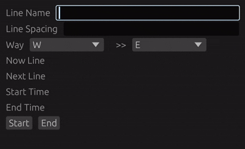
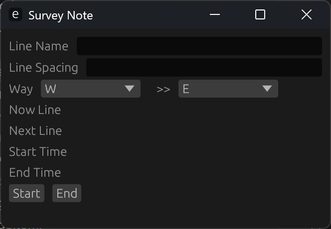
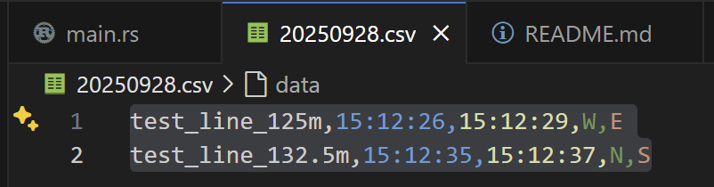

## rust로 제작하는 기록 프로그램

- 목적 : 현장 탐사시 종이로 작성할 때 너무 번거로운 부분이 있어 만들게 되었다.
---

---

---

#### 프로젝트 제작 중 러스트 몰랐던 점.
##### 1. ::, . 차이
- :: > Path Separator(경로 구분자)
    * 모듈을 불러올 때 사용
- . > Method Call Operator()
    * 인스턴스 메서드를 사용할 때 사용

##### 2. &, mut &
- &만 있으면 단순 참조, 메모리에서 값만 읽어서 사용 가능.
- mut &가 있으면 참조 및 수정 가능, 원본값 수정 가능함

##### 3. unwrap
- 
